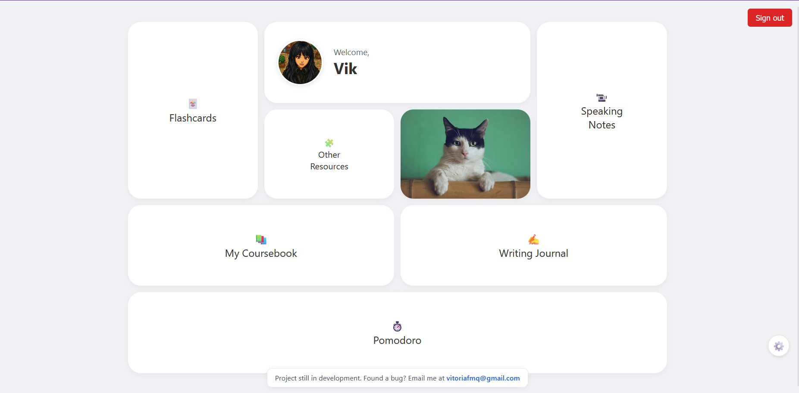
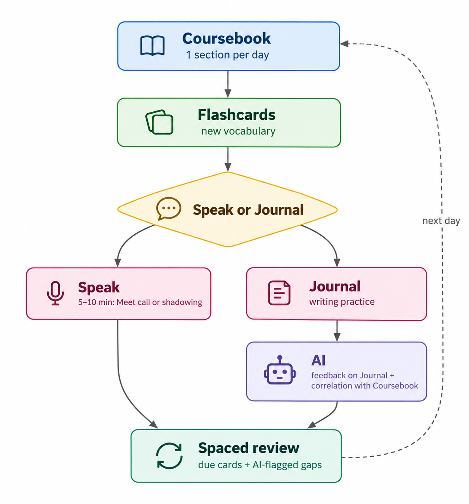

# 🧠 English with ADHD: Output First

  
  
  

A flexible English self-study framework focused on **active vocabulary use, writing, speaking, AI feedback, and spaced repetition**.

Designed to make English practice more manageable, reduce unnecessary cognitive overload, and help learners build consistency at their own pace.

  <a href="https://vihari2.github.io/english-with-adhd/"><strong>🚀 Try the Live Demo</strong></a>

  

## 🎯 The Method

**Coursebook → Flashcards → Speak or Journal → AI Feedback → Spaced Review**

  

The framework follows a simple learning cycle:

- **Coursebook:** Study a short section of English learning material.
- **Flashcards:** Learn new vocabulary and review previously studied words.
- **Speak or Journal:** Practice using English through speaking or writing.
- **AI Feedback:** Identify mistakes, improve phrasing, and reinforce what you have learned.
- **Spaced Review:** Revisit flashcards and recurring language difficulties over time.

The goal is to focus on one step at a time while keeping the learning process flexible and sustainable.

## 🧩 Design Principles

- **One step at a time:** Make it easier to decide what to do next.
- **Less cognitive overload:** Keep the interface simple and focused.
- **Flexible study sessions:** Adapt practice to your time and energy.
- **No guilt for taking breaks:** Resume studying at your own pace.
- **Active learning:** Prioritize using English instead of only consuming content.

## 🛠️ Tools

- **ChatGPT / Gemini:** Writing corrections, feedback, and conversation practice.
- **Google Meet:** Speaking practice and recordings.
- **YouTube:** Listening practice and shadowing.
- **Coursebooks & Flashcards:** Structured learning, vocabulary building, and spaced repetition.
- **Lo-fi Music:** Optional background music for study sessions.

## 📊 English Level

**EF SET — August 17, 2026**

B2 Independent · 53/100

## 📚 Learning Guides

| Guide | Description |
|---|---|
| [Writing & AI](please-read/writing-guide.md) | Journaling, corrections, and feedback. |
| [Speaking](please-read/speaking.md) | Speaking practice and shadowing. |
| [Coursebooks](please-read/coursebooks.md) | Recommended books by level. |
| [Other Resources](please-read/other-resources.md) | Websites, reading materials, and study tools. |

## 📄 License

Open-source project created by [vihari2](https://github.com/vihari2).

---

  <a href="#-english-with-adhd-output-first">⬆ Back to Top</a>

